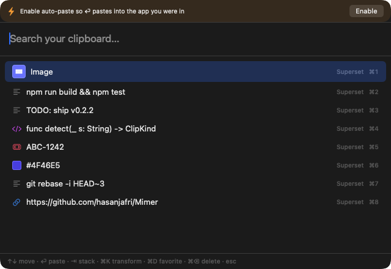
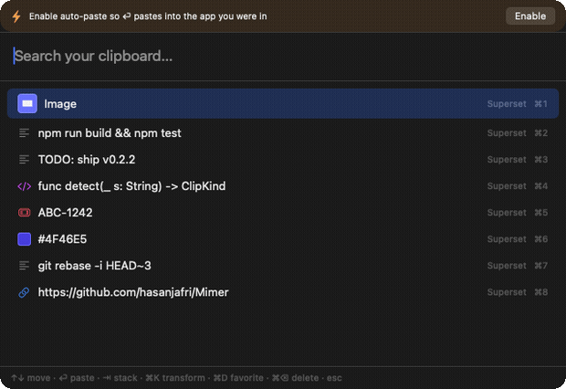
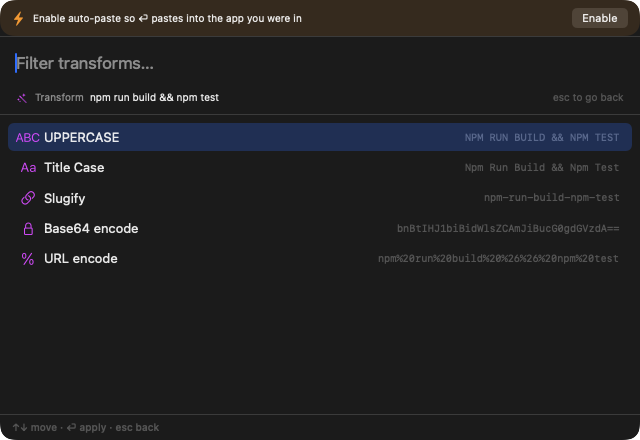
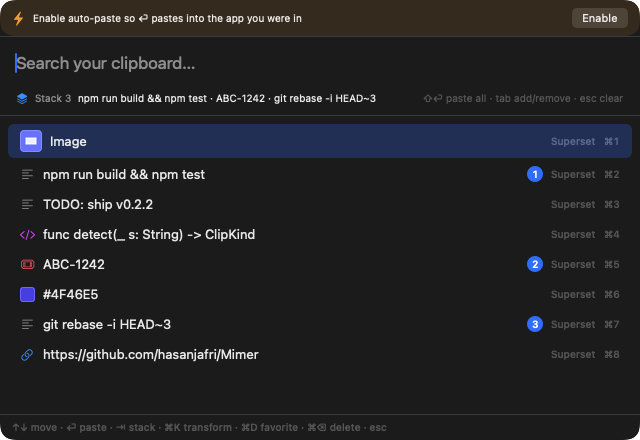
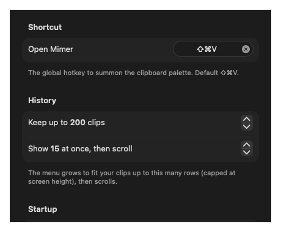
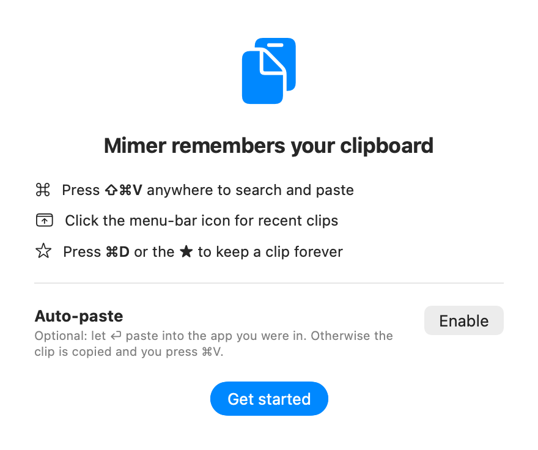

# Mimer

[](https://github.com/hasanjafri/Mimer/actions/workflows/ci.yml)

**A fast, private, developer-first clipboard manager for macOS — free and open source.**

Named after *Mímir*, the Norse guardian of memory, Mimer lives in your menu bar,
remembers everything you copy, and gets out of the way until you press **⇧⌘V** — then
it's a fast command palette that understands what you copied and can transform it on the spot.

<p align="center">
  
</p>

> Status: **v0.2.2 — live.** Notarized, Homebrew-installable, and auto-updating via
> Sparkle. **Website:** [mimer.hasanjafri.com](https://mimer.hasanjafri.com/) ·
> See [CHANGELOG.md](CHANGELOG.md) for what's new and [docs/ROADMAP.md](docs/ROADMAP.md) for what's next.

---

## Why Mimer

I built Mimer because I got tired of my old clipboard manager (CopyClip) — and then it
wanted me to pay for **CopyClip 2** to keep going. A clipboard manager is something you
live in all day; it should be fast, private, and free. So I made the one I wanted:

- **Type-aware** — it knows a link from code from a color from a git SHA, and shows the right glyph (with a live swatch for colors).
- **⌘K transforms** — reshape a clip in place with a live preview: case, slugify, Base64/URL, JSON pretty-print, **JSON → TypeScript**, **decode a JWT**, **Unix ↔ ISO** time, and more.
- **Built for developers** — scoped search (`type:`, `app:`, `/regex/`), a paste-stack, and **⌘O** to open a commit / issue / `file:line` straight in your tools.
- **Private by default** — local-only, no telemetry, no subscription; history is **encrypted at rest** and detected secrets are masked on screen.

Free and open source (MIT) — and it stays that way. If you've used **Maccy** or
**CopyClip**, think of Mimer as a free, faster, developer-focused alternative.

## Features

**Search as you type** — fuzzy match, with scoped filters (`type:`, `app:`, `is:fav`, `/regex/`):

<p align="center">
  
</p>

**⌘K transforms** — every transform shows a live preview, and only the ones that apply are listed:

<p align="center">
  
</p>

**Paste-stack** — queue several clips with **⇥**, then **⇧⏎** to paste them all in order:

<p align="center">
  
</p>

### Everything else

- **Clipboard history** — everything you copy, newest first, surviving restarts; quick-paste a top result with **⌘1–⌘9**.
- **Type-aware clips** — links, code, colors, **git SHAs, issue keys (`ABC-123`), and file paths / stack-trace `file:line`** each get their own glyph; hex colors show a live swatch.
- **Image clips** — copied images are captured with a thumbnail in the list and pasted right back; like all clips, they're **encrypted at rest** (the blob files hold only ciphertext).
- **⌘O — act on a clip** — context-aware: reveal a masked secret, open a link in your browser, or reveal a file path / `file:line` in Finder. Set a git remote, issue tracker, or editor in **Settings → Developer** and ⌘O also opens a commit SHA's page, an issue key in your tracker, or a `file:line` in VS Code/Cursor.
- **More ⌘K transforms** (beyond the previews shown above) — `camelCase`/`snake_case`, sort/dedupe/reverse lines, **strip URL tracking params**, **decode a query string**, JSON pretty/minify — each shown only when it applies.
- **Favorites** — ⌘D (or the ★) keeps a clip forever, pinned in its own section.
- **Snippets** — author reusable text (signatures, boilerplate) that lives in the palette forever.
- **Secret-aware** — detected API keys, tokens, and private keys are **masked** in the list (`AWS key ••••1234`, with a 🔒) so they're not on screen during a screenshare. They're still stored locally and pasted in full — unlike cloud tools, Mimer doesn't drop your secrets, it just hides them from view. Toggle in Privacy settings.
- **Pause + per-app exclusions** — stop recording on demand, or never record while chosen apps are frontmost. Password managers are always ignored.
- **Auto-paste (optional)** — ⏎ pastes straight into your previous app once you grant the one permission; otherwise the clip is on your clipboard for ⌘V.
- **Launch at login**, configurable history size, and a configurable menu height.

Planned: file clips, more transforms, OCR on images.

## Keyboard

| Key | Action |
| --- | --- |
| `⇧⌘V` | Open / close the palette (rebindable in Settings → General) |
| `↑` `↓` | Move selection |
| `⏎` | Paste the selected clip |
| `⌘1`–`⌘9` | Paste that result |
| `⌘K` | Transform the selected clip |
| `⌘D` | Favorite / unfavorite |
| `⌫` | Delete the selected clip |
| `esc` | Close (or leave transform mode) |

The palette hotkey and history limits are configurable in **Settings → General**:

<p align="center">
  
</p>

## Privacy

Mimer stores history in a local Core Data database under
`~/Library/Application Support/Mimer/` and makes **no network requests**. Clip
contents **and the captured source-app name** are **encrypted at rest** (AES-GCM; the
key lives in your macOS Keychain, this-device-only) — the sqlite file holds only
ciphertext, and upgrading encrypts your existing history in place and scrubs the old plaintext. It also ignores clips
marked transient/concealed/auto-generated (the standard `org.nspasteboard.*` hints
password managers and other tools set) and ships with a built-in password-manager
blocklist (1Password, Bitwarden, Apple Passwords, KeePassXC, …). Reading the
clipboard needs no special permission; auto-paste is opt-in and uses macOS's
post-event permission (not Accessibility).

> Encryption is at-rest only: clips are decrypted in memory to show and paste them,
> and the key is local to this Mac (not iCloud-synced), so history can't be read
> from the DB file alone. If you lose the Keychain key (e.g. migrating Macs without
> it), previously-stored history becomes unreadable — that's inherent to at-rest encryption.

## Install

On first launch Mimer walks you through the basics (and auto-paste is opt-in — it works fully without any permission):

<p align="center">
  
</p>

**Download** (signed + notarized): grab the latest `Mimer-x.y.z.dmg` from
[Releases](https://github.com/hasanjafri/Mimer/releases/latest), open it, and drag
Mimer to Applications. Requires macOS 14+.

**Homebrew:**

```sh
brew install --cask hasanjafri/tap/mimer
```

**Build from source:**

```sh
brew install xcodegen          # one-time
git clone https://github.com/hasanjafri/Mimer.git
cd Mimer
xcodegen generate              # writes Mimer.xcodeproj from project.yml
open Mimer.xcodeproj           # ⌘R to run, or:
xcodebuild -scheme Mimer -configuration Release build
```

Requires macOS 14+ and the Xcode command-line tools.

## Tech

Swift + SwiftUI (`MenuBarExtra`) with an AppKit `NSPanel` for the nonactivating
command palette, Core Data for history, and
[KeyboardShortcuts](https://github.com/sindresorhus/KeyboardShortcuts) for the
global hotkey. The Xcode project is generated from `project.yml` via
[XcodeGen](https://github.com/yonaskolb/XcodeGen) (so the `.xcodeproj` is not
committed). See [`docs/`](docs/) for the research, design, plan, and reviews.

## Contributing

Issues and PRs welcome. See [CONTRIBUTING.md](CONTRIBUTING.md) for build/test (run
`xcodegen generate` first), [CHANGELOG.md](CHANGELOG.md) for what's changed, and
[SECURITY.md](SECURITY.md) to report anything security-sensitive privately.

## License

[MIT](LICENSE) — © 2026 Hasan Jafri.
